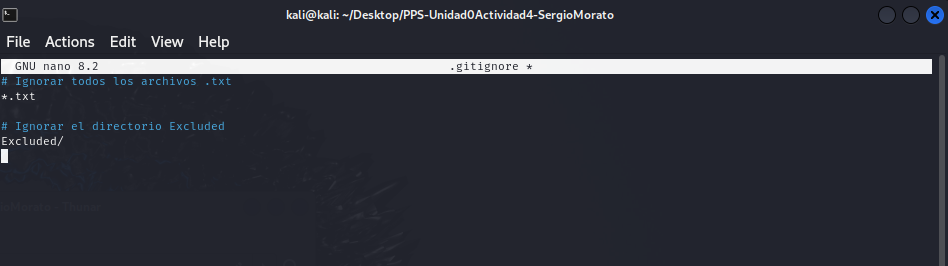
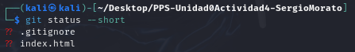
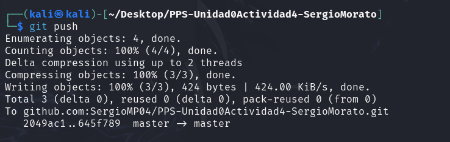

# PPS-Unidad0Actividad4-SergioMorato

Este proyecto consiste en crear y configurar un repositorio para una página web sencilla que se podrá visualizar a través de un pequeño servidor PHP. A continuación se detallan los pasos realizados para completar la actividad.

## Índice

- [PPS-Unidad0Actividad4-SergioMorato](#pps-unidad0actividad4-sergiomorato)
  - [Índice](#índice)
  - [1. Configuración inicial de Git](#1-configuración-inicial-de-git)
  - [2. Creación de Proyecto y repositorio](#2-creación-de-proyecto-y-repositorio)
  - [3. Iniciando Proyecto](#3-iniciando-proyecto)
  - [4. Ignorando Archivos](#4-ignorando-archivos)
  - [4. Trabajo con Git](#4-trabajo-con-git)
  - [5. Creación de nuestro servidor web y visualización de nuestro proyecto](#5-creación-de-nuestro-servidor-web-y-visualización-de-nuestro-proyecto)
  - [6. Seguimos Trabajando con Git](#6-seguimos-trabajando-con-git)
  - [7. Trabajando con los Logs en Git](#7-trabajando-con-los-logs-en-git)
  - [8. Trabajando con Ramas en Git](#8-trabajando-con-ramas-en-git)

## 1. Configuración inicial de Git

Configura el editor de comandos en Git:

```bash
   git config --global core.editor nano
```

Para ver que todo se haya ido editando correctamente podremos hacer un:

```bash
   git config --global --get core.editor

```
<p align="center">
  
</p>

Configura la visualización de git diff y git log para mostrar todo el mensaje sin un editor adicional:

```bash
git config --global core.pager ''
```

Comprueba las variables de configuración de Git:

```bash
git config --help
```

<p align="center">
  
</p>

Ajusta los valores de las variables de color en Git:

```bash
git config --global color.status auto
git config --global color.branch auto
git config --global color.interactive auto
git config --global color.diff auto
```

<p align="center">
  
</p>

## 2. Creación de Proyecto y repositorio

 Inicializa el repositorio Git en la carpeta

```bash
git init
```

Agregaremos todos los archivos al repositorio:

```bash
git add .
```

Realizaremos un commit inicial:

```bash
git commit -m "Initial commit"
```

Enlazaremos el repositorio local con el remoto en GitHub. Si aún no tienes el repositorio en GitHub, créalo y copia la URL SSH o HTTPS. Luego, reemplaza la URL en el siguiente comando:

```bash
git remote add origin git@github.com:SergioMP04/PPS-Unidad0Actividad4-SergioMorato.git
```

Subiremos el proyecto a GitHub:

```bash
git push -u origin master
```

<p align="center">
  
</p>

## 3. Iniciando Proyecto

Como en mi caso lo que he hecho ha sido ir redactando este README a medida que iba haciendo el ejercicio, ya lo tengo creado y en local. Ahora vamos a subirlo a un repositorio que he creado, el cual se llama como la actividad. A continuación, te explico los pasos para hacerlo.

Dado que ya tienes la carpeta del proyecto en tu sistema, aquí tienes los pasos para subirla a GitHub:

1. **Accede al directorio del proyecto** (si aún no estás en él):

    ```bash
    cd ~/Desktop/PPS-Unidad0Actividad4-SergioMorato
    ```

2. **Ver los archivos y las ramas que contiene el repositorio**:

    Para ver la estructura de carpetas y archivos en el directorio, ejecuta:

    ```bash
    tree -a
    ```

    

3. Como mencioné anteriormente, al principio no he añadido nada a la carpeta, por lo que al ejecutar el siguiente comando, el estado de Git debería mostrar los archivos pendientes de agregar:

    ```bash
    git status -s
    ```

    

---

## 4. Ignorando Archivos

1. **Creación de la carpeta `Excluded`**:

    Vamos a comenzar creando una carpeta que se llame `Excluded`, donde colocaremos documentación que no queremos que sea subida al repositorio.

    ```bash
    mkdir excluded
    ```

2. **Creación de un archivo vacío en la carpeta `Excluded`**:

    Ahora, creamos un archivo vacío dentro de la carpeta `Excluded` para comprobar que se ignora correctamente.

    ```bash
    touch Excluded/archivo_vacio.txt
    ```

3. **Creación de un archivo `excluido.txt` en la raíz del proyecto**:

    También vamos a crear un archivo con el nombre `excluido.txt` en el directorio principal del repositorio, el cual debería ser ignorado por Git.

    ```bash
    touch excluido.txt
    ```

4. **Creación del archivo `.gitignore`**:

    Ahora vamos a crear un archivo llamado `.gitignore`, que indicará a Git qué archivos y carpetas no deben ser rastreados ni subidos al repositorio.

    ```bash
    nano .gitignore
    ```

    Dentro del archivo `.gitignore`, añadimos las siguientes líneas para ignorar todos los archivos con extensión `.txt` y la carpeta `Excluded`:

    ```bash
    # Ignorar todos los archivos .txt
    *.txt

    # Ignorar el directorio Excluded
    Excluded/
    ```

    

5. **Verificar que los archivos están siendo ignorados**:

    Ahora, comprobamos el estado del repositorio para verificar que los archivos y directorios especificados en `.gitignore` no son rastreados por Git. Ejecutamos el siguiente comando:

    ```bash
    git status -s
    ```

    

## 5. Trabajo con Git

1. **Crea un archivo con nombre `index.html`**:
    Abre tu terminal y usa el siguiente comando para crear el archivo `index.html`.

    ```bash
    touch index.html
    ```

2. **Introduce el código HTML para mostrar el mensaje de "Hola Mundo" con tu nombre**:
    Abre el archivo `index.html` en un editor de texto, como `nano`:

    ```bash
    nano index.html
    ```

    Luego, introduce el siguiente código HTML para mostrar un mensaje con tu nombre (modifica `$USER` con tu nombre):

    ```html
    <H1>Hola SergioMorato¡¡¡ ¿Qué tal te encuentras?</H1>
    ```

      
    Guarda y cierra el archivo.

3. **Visualiza el estado del proyecto**:
    Ejecuta el siguiente comando para ver el estado del proyecto, y observa las modificaciones pendientes.

    ```bash
    git status --short
    ```

      

4. **Añade el archivo `index.html` al proyecto**:
    Usa el comando `git add` para añadir el archivo `index.html` al área de preparación (staging).

    ```bash
    git add index.html
    ```

5. **Haz un commit con el mensaje correspondiente**:
    Realiza el commit con el siguiente comando, agregando un mensaje descriptivo sobre lo que se ha hecho.

    ```bash
    git commit -am "Añadido archivo index.html con mensaje de bienvenida"
    ```

6. **Vuelve a comprobar el estado del proyecto**:
    Revisa nuevamente el estado del proyecto para asegurarte de que todo esté en orden.

    ```bash
    git status --short
    ```

      
7. **Sube los cambios a tu repositorio de GitHub**:
    Finalmente, sube tus cambios al repositorio remoto en GitHub con el siguiente comando:

    ```bash
    git push
    ```

      

## 6. Creación de nuestro servidor web y visualización de nuestro proyecto

1. **Abre una nueva pestaña de terminal**:
    Abre una nueva terminal en tu sistema para poder ejecutar el servidor web en paralelo.

2. **Ejecuta el comando para lanzar el servidor PHP**:
    En la nueva pestaña de terminal, navega al directorio donde se encuentra el archivo `index.html`. Luego, ejecuta el siguiente comando para iniciar un servidor PHP local en el puerto 8080:

    ```bash
    php -S 0:8080
    ```

    Este comando inicia un servidor web en tu máquina local, accesible en el puerto `8080`.

3. **Visualiza la página en tu navegador**:
    Ahora, abre un navegador web y accede a la página que has creado. Ingresa la siguiente URL en la barra de direcciones de tu navegador:

    ```bash
    http://localhost:8080
    ```

    O, si prefieres usar la dirección IP de tu máquina:

    ```bash
    http://<tu_direccion_ip>:8080
    ```

    Aquí verás el mensaje de "Hola SergioMorato¡¡¡ ¿Qué tal te encuentras?" que creaste en el archivo `index.html`.

      

## 7. Seguimos Trabajando con Git

1. **Haz una copia del archivo `index.html` con el nombre `index.html.save`**:
    Copia el archivo `index.html` a un nuevo archivo llamado `index.html.save`. Ejecuta el siguiente comando en la terminal:

    ```bash
    cp index.html index.html.save
    ```

2. **Modifica el fichero `index.html` para cambiar el texto mostrado en la página web**:
    Abre el archivo `index.html` con un editor de texto y cambia el contenido del mensaje, por ejemplo:

    ```html
    <H1>Hola $USER¡¡¡ ¿Cómo estás hoy?</H1>
    ```

3. **Verifica el estado del proyecto**:
    Usa el siguiente comando para comprobar el estado del proyecto y ver si hay cambios pendientes:

    ```bash
    git status -s
    ```

      

4. **Comprueba las diferencias de los archivos que no han sido añadidos**:
    Para ver qué cambios has realizado en `index.html` y otras modificaciones, ejecuta:

    ```bash
    git diff
    ```

      

5. **Refresca el navegador para comprobar que ha cambiado el contenido de nuestra página web**:
    Abre tu navegador y actualiza la página (`Ctrl+R` o `Cmd+R` en macOS) para ver cómo ha cambiado el contenido.

      

6. **Vuelve a la versión anterior del archivo `index.html`**:
    Si deseas revertir los cambios que hiciste en `index.html`, puedes usar el siguiente comando:

    ```bash
    git restore index.html
    ```

7. **Vuelve a refrescar el navegador para ver cómo vuelve a la versión inicial**:
    Actualiza nuevamente la página en tu navegador para ver el contenido original del archivo.

      

8. **Utiliza el comando `git mv` para sobreescribir el archivo `index.html` con `index.html.save`**:
    Renombra el archivo `index.html.save` para reemplazar el archivo original `index.html`:

    ```bash
    git mv index.html.save index.html
    ```

9. **Mira el estado del proyecto y confirma todos los cambios**:
    Ejecuta el siguiente comando para verificar los cambios y asegurarte de que todo está correcto:

    ```bash
    git status -s
    ```

      

10. **Haz un push y comprueba cómo han subido los archivos a GitHub**:
    Para subir los cambios al repositorio remoto en GitHub, usa el siguiente comando:

    ```bash
    git push
    ```

    Ahora, los archivos modificados deberían estar disponibles en tu repositorio de GitHub.

11. **Modifica el archivo `index.php` desde la página de GitHub.com**:
    Accede a tu repositorio en GitHub y edita directamente el archivo `index.php` desde la interfaz web de GitHub.

      

12. **Haz un pull y comprueba cómo se ha modificado la página web en nuestro navegador**:
    Vuelve a tu terminal y ejecuta el siguiente comando para descargar los cambios de GitHub:

    ```bash
    git pull
    ```

      

## 8. Trabajando con los Logs en Git

1. **Mira la página de Git Book sobre los comandos `git log`**:
    Para entender mejor cómo funciona `git log`, consulta la [documentación oficial de Git sobre los comandos `git log`](https://git-scm.com/book/es/v2/Fundamentos-de-Git-Ver-el-Historial-de-Confirmaciones).

2. **Muestra los logs**:
    Para ver el historial completo de confirmaciones (commits), puedes ejecutar el siguiente comando:

    ```bash
    git log
    ```

      

    Este comando te mostrará una lista de todas las confirmaciones en el repositorio.

3. **Muestra los logs de los últimos 3 commits**:
    Si solo quieres ver los últimos tres commits, puedes usar el siguiente comando:

    ```bash
    git log -n 3
    ```

      

    Esto te mostrará los detalles de las tres últimas confirmaciones realizadas en el repositorio.

4. **Muestra los logs utilizando el modificador `--pretty`**:
    Para personalizar la salida de los logs y hacerlo más legible o adecuado a tus necesidades, puedes usar el modificador `--pretty`. Por ejemplo, para ver solo el hash y el mensaje de cada commit, puedes ejecutar:

    ```bash
    git log --pretty=oneline
    ```

      

    Esto te dará una vista compacta de los commits, mostrando un solo registro por cada commit.

5. **Muestra los logs de los últimos 2 commits donde se vean las diferencias de cada una de las entradas**:
    Si deseas ver las diferencias entre los últimos dos commits, puedes usar el siguiente comando:

    ```bash
    git log -n 2 --stat
    ```

      

    Esto mostrará un resumen de los dos últimos commits, junto con las diferencias (cambios) que se realizaron en cada uno.

6. **Muestra los logs de las modificaciones realizadas en el último día**:
    Para ver los cambios realizados en el último día, puedes usar el siguiente comando:

    ```bash
    git log --since="1 day ago"
    ```

      
    Este comando te mostrará todas las confirmaciones que se han hecho en las últimas 24 horas.

## 9. Trabajando con Ramas en Git

1. **Lista las ramas existentes**:
    Para ver las ramas que existen en tu repositorio, puedes usar el siguiente comando:

    ```bash
    git branch
    ```

      

    Este comando te mostrará todas las ramas locales del repositorio. La rama actual estará indicada con un asterisco (`*`).

2. **Crea una nueva rama con nombre `Vers1` a partir de la rama actual**:
    Para crear una nueva rama llamada `Vers1` basada en la rama actual, ejecuta el siguiente comando:

    ```bash
    git branch Vers1
    ```

    Esto creará la nueva rama llamada `Vers1`, pero no te cambiará automáticamente a ella.

    Si también quieres cambiar a la rama `Vers1` después de crearla, usa:

    ```bash
    git checkout Vers1
    ```

    O puedes combinar ambos pasos con el siguiente comando:

    ```bash
    git checkout -b Vers1
    ```

3. **Haz una modificación del archivo `index.html` y guarda las modificaciones**:
    Ahora, abre el archivo `index.html` y realiza alguna modificación. Por ejemplo, cambia el texto o añade algún contenido nuevo. Guarda el archivo después de hacer los cambios.

4. **Sube los cambios al repositorio remoto a la rama `Vers1`**:
    Para añadir los cambios al área de staging y hacer commit, ejecuta los siguientes comandos:

    ```bash
    git add index.html
    git commit -m "Modificación en index.html en la rama Vers1"
    ```

      
      *Aquí he decidido adjuntar varias capturas ya que de una a uno lo veia coherente.
    Luego, sube estos cambios al repositorio remoto a la rama `Vers1` usando el siguiente comando:

    ```bash
    git push origin Vers1
    ```

      

    Esto empujará los cambios a la rama `Vers1` en tu repositorio remoto de GitHub.

    **Nota**: Si `Vers1` no existía en el repositorio remoto, Git automáticamente la creará en el servidor al hacer `git push`.

5. **Compara las diferencias entre las ramas `main` y `Vers1`**:
    Si deseas ver cómo las ramas `main` y `Vers1` son diferentes, puedes usar el siguiente comando para comparar ambas ramas:

    ```bash
    git diff main..Vers1
    ```

    Esto mostrará las diferencias entre la rama `main` y la rama `Vers1`, es decir, los cambios que se han hecho en `Vers1` pero no en `main`.

      
